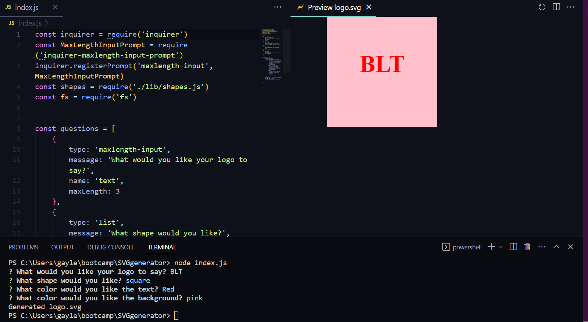

# SVGgenerator(Challenge #10)
# 
## Description
This project is a logo generator to make a simple SVG file, which will format information  from a commandline interface to make a 3 character logo  - in ne of three shapes with variable color options.
## Usage
AS A USER I want to save time when making simple logos by havingan SVG file generated automatically through a commandline interface.

  <a href= "https://drive.google.com/file/d/1vn0xBEuC7i-7j-k5KmqXgThsXY7nPsd1/view"> Link for video Explanation </a>

## Installation
This project requires Node v16 with the inquirer package installed.  You must download an SVG previewer to see the rendered image. 

## Credits
All code and images @goldengayle

## License
MIT License
Copyright (c) 2023 goldengayle
Permission is hereby granted, free of charge, to any person obtaining a copy of this software and associated documentation files (the "Software"), to deal in the Software without restriction, including without limitation the rights to use, copy, modify, merge, publish, distribute, sublicense, and/or sell copies of the Software, and to permit persons to whom the Software is furnished to do so, subject to the following conditions:
The above copyright notice and this permission notice shall be included in all copies or substantial portions of the Software.
THE SOFTWARE IS PROVIDED "AS IS", WITHOUT WARRANTY OF ANY KIND, EXPRESS OR IMPLIED, INCLUDING BUT NOT LIMITED TO THE WARRANTIES OF MERCHANTABILITY, FITNESS FOR A PARTICULAR PURPOSE AND NONINFRINGEMENT. IN NO EVENT SHALL THE AUTHORS OR COPYRIGHT HOLDERS BE LIABLE FOR ANY CLAIM, DAMAGES OR OTHER LIABILITY, WHETHER IN AN ACTION OF CONTRACT, TORT OR OTHERWISE, ARISING FROM, OUT OF OR IN CONNECTION WITH THE SOFTWARE OR THE USE OR OTHER DEALINGS IN THE SOFTWARE.
